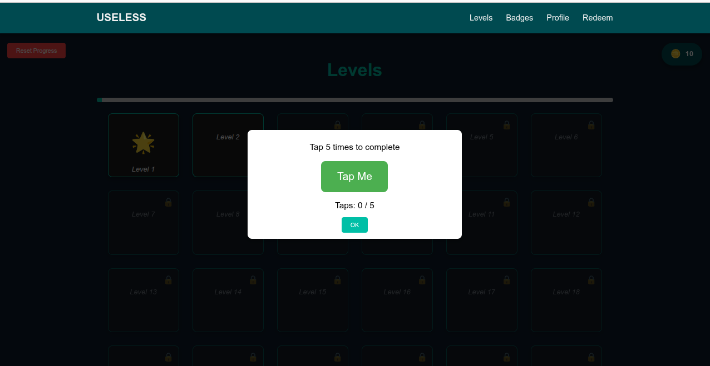
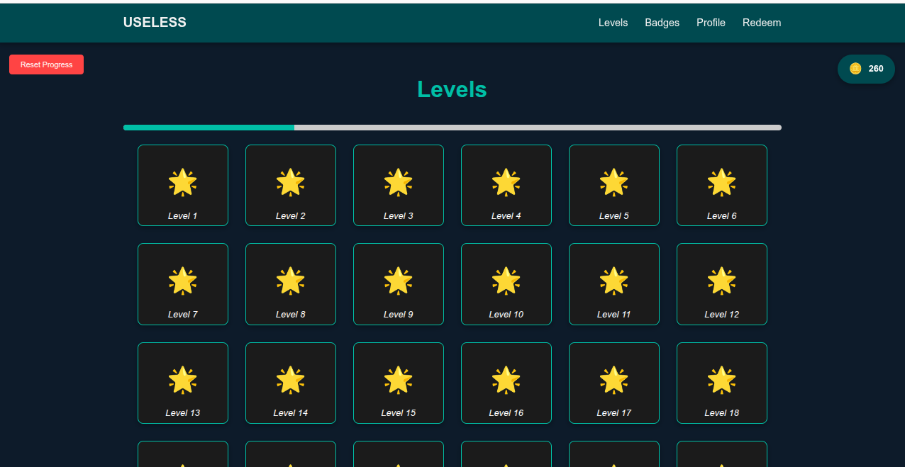
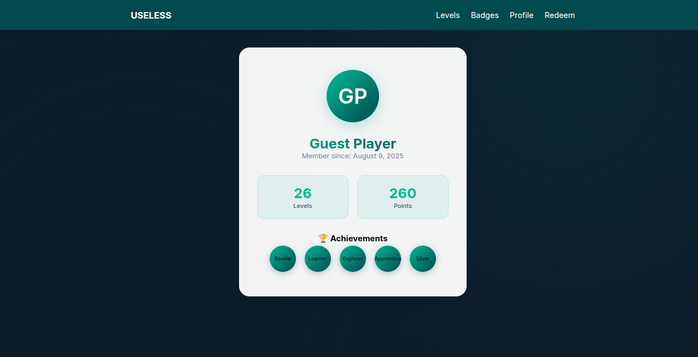
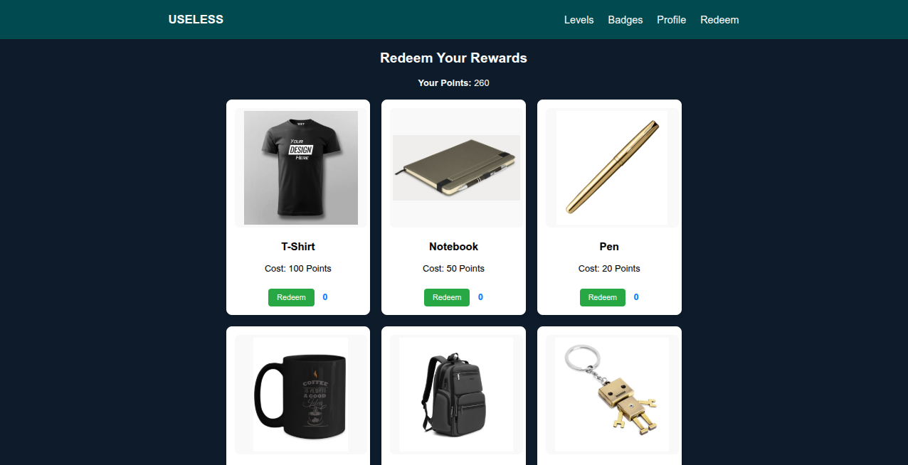

# GOOFLOOP 🎯


## Basic Details
### Team Name: ASWAMEDHAM


### Team Members
- Team Lead: Nandhana Rajendran - GEC Idukki 
- Member 2: Aswathy A - GEC Idukki 
 

### Project Description
GoofLoop is a fun, interactive, web-based game platform with 100 progressively unlocked levels.  
Each level presents a quirky, “useless” challenge — from clicking a moving box to holding a button for 3 seconds and etc — rewarding with points, badges, and confetti (because why not?).Can be purchase goodies with the eraned points

### The Problem (that doesn't exist)
When there’s absolutely nothing to do, and you still want to feel like you’ve accomplished… something.


### The Solution (that nobody asked for)
We include simple games. Each level has a useless task to complete.”

## Technical Details
### Technologies/Components Used
For Software:
- HTML,CSS,JavaScript 
- VS Code,Git,Github,Netlify
 
### Implementation
For Software:
# Installation
```bash
git clone https://github.com/NandhanaRajendran/Aswamedham.git
cd Aswamedham
# Run
Open index.html in a web browser.

### Project Documentation
For Software:

# Screenshots (Add at least 3)

*This is the login page*


*It shows how the levels are arranged*


*Here displays the badges earned*


*Here we can see how far we arrived*


*ere we can purchase goodies with our points*

# Diagrams

*Add caption explaining your workflow*

For Hardware:

# Schematic & Circuit

*Add caption explaining connections*


*Add caption explaining the schematic*

# Build Photos

*List out all components shown*


*Explain the build steps*


*Explain the final build*

### Project Demo
# Video
[Add your demo video link here]
*Explain what the video demonstrates*

# Additional Demos
https://aswamedham.netlify.app/

## Team Contributions
- Aswathy A: Idea ,Login page and Profile page creation,Website testing.
- Nandhana Rajendran: Level Page,Redeem and Badges page creation,deployment. 
 

---
Made with ❤️ at TinkerHub Useless Projects 


